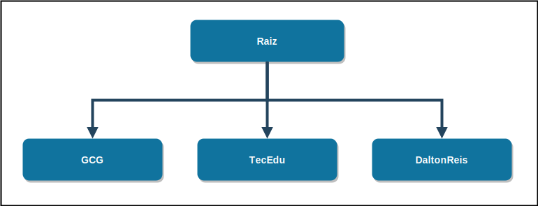

# GCG - Grupo de Computação Gráfica
Programa Geral de produção em Ensino, Pesquisa e Extensão.

## Git GCG

Material desenvolvidos pelas equipes de alunos em projetos nas disciplinas ministradas.  
[Link GitHub: https://github.com/GCG-FURB](https://github.com/GCG-FURB)

## Git TecEdu

Aplicações de Objetos de Aprendizagem Educacionais.  
[Link GitHub: https://github.com/tecedufurb](https://github.com/tecedufurb)

## Git DaltonReis

Material de disciplinas ministradas, Trabalhos de Conclusão de Curso e Projetos (de pesquisa e Extensão) desenvolvidos, trechos de rotinas de códigos de Oficinas de implementação.  
[Link GitHub: https://github.com/dalton-reis](https://github.com/dalton-reis)
